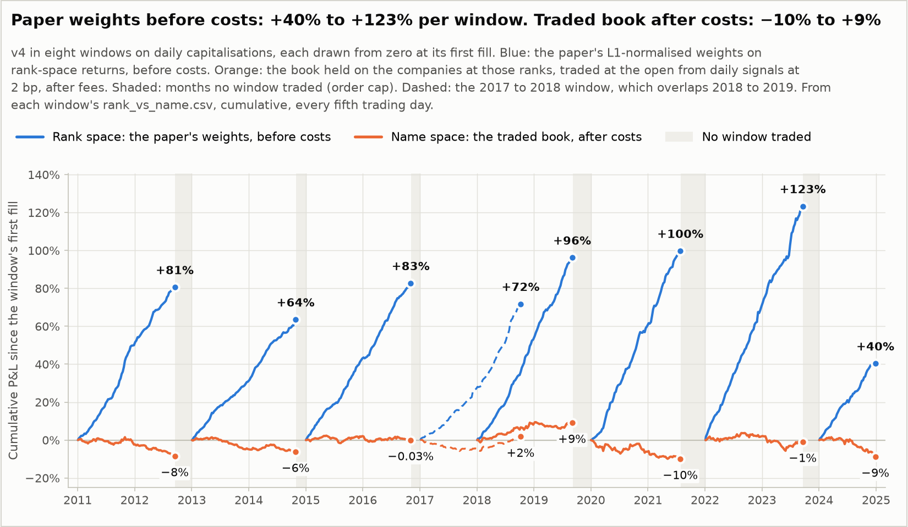
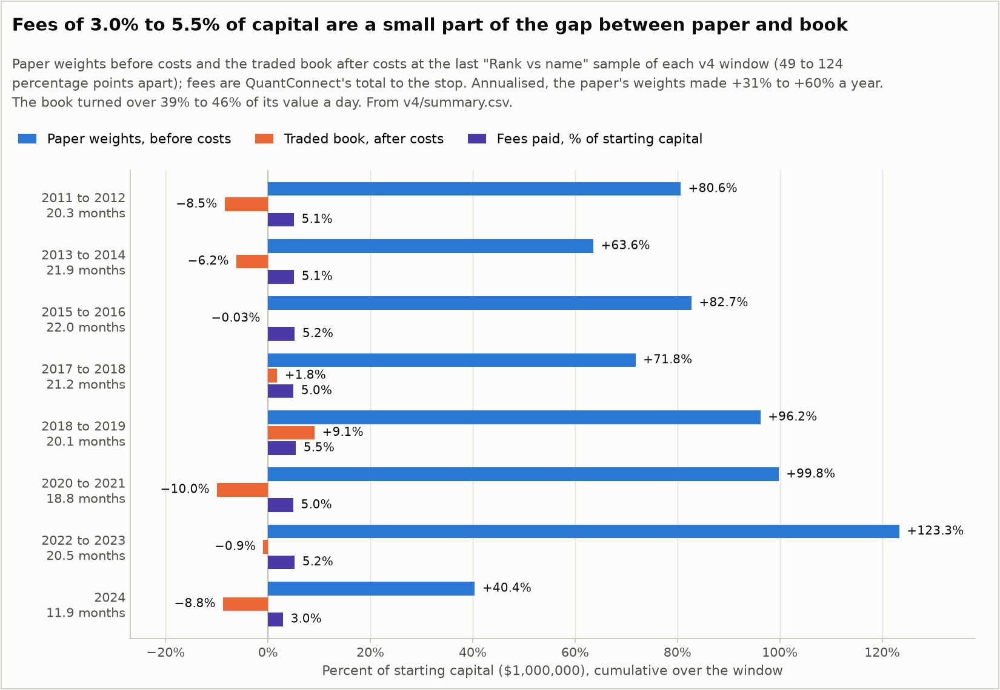
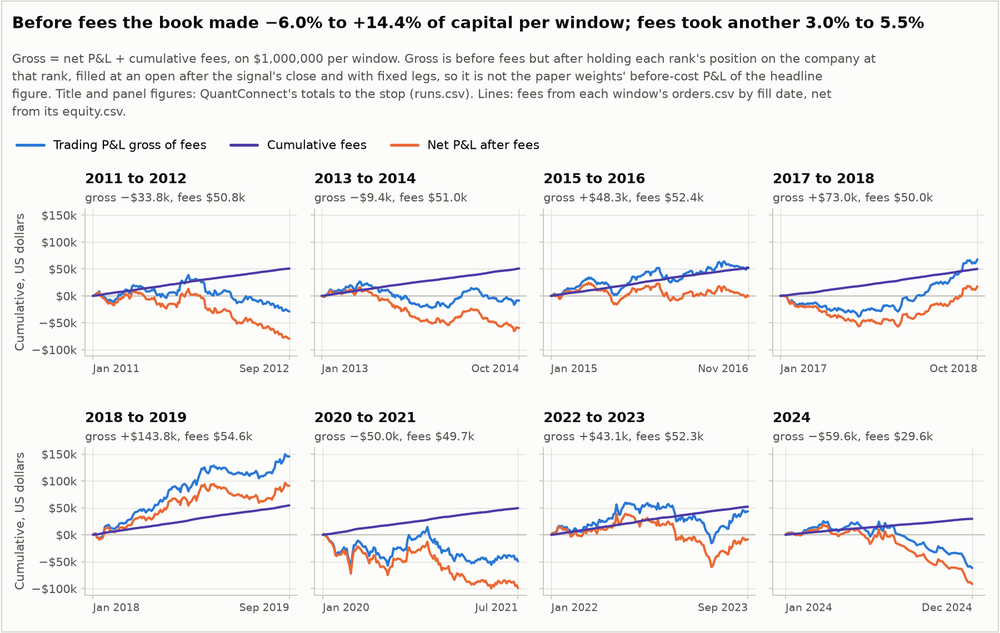
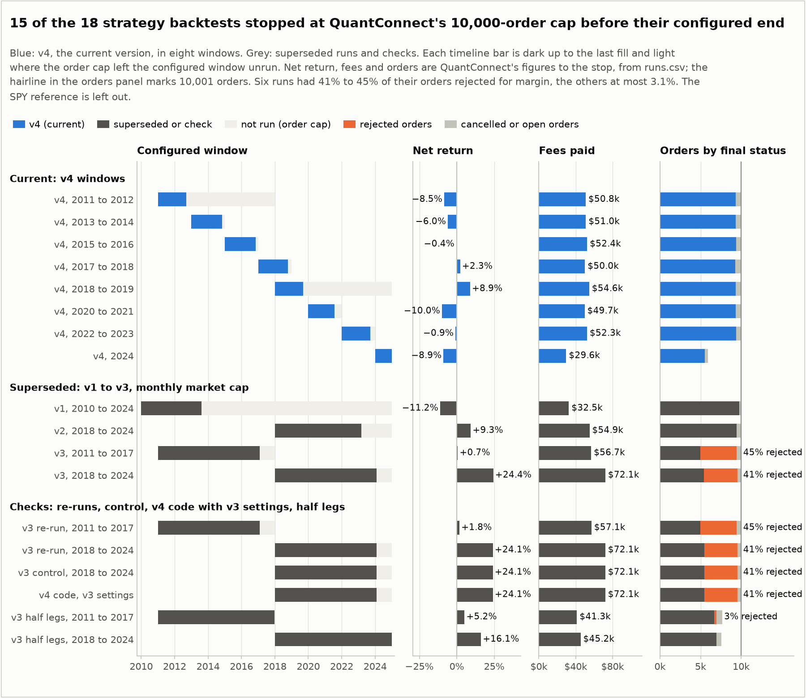

# Statistical arbitrage in rank space

An implementation of the parametric strategy in Y.-F. Li and G. Papanicolaou, *Statistical
Arbitrage in Rank Space* ([arXiv:2410.06568v1](https://arxiv.org/abs/2410.06568v1), Stanford, 2024),
backtested on QuantConnect with its point-in-time market capitalisations rolled forward to daily
values, 2 basis points of cost and rebalancing from daily data, together with the audit of a 2024
attempt at the same paper.

[](pyproject.toml)
[](https://github.com/QuantConnect/Lean)
[](LICENSE)
[](https://github.com/danyilnep/stat-arb-rank-space/actions/workflows/ci.yml)

## Result



| v4 window | Months covered | Paper weights, before costs | Traded book, after costs | Sharpe ratio | Fees |
|---|---|---|---|---|---|
| 2011 to 2012 | 20.3 | +80.63% | −8.46% | −1.43 | $50,811.37 |
| 2013 to 2014 | 21.9 | +63.56% | −6.18% | −1.332 | $50,980.39 |
| 2015 to 2016 | 22.0 | +82.74% | −0.03% | −0.368 | $52,384.69 |
| 2017 to 2018 | 21.2 | +71.80% | +1.78% | −0.387 | $50,004.42 |
| 2018 to 2019 | 20.1 | +96.21% | +9.10% | 0.315 | $54,627.73 |
| 2020 to 2021 | 18.8 | +99.76% | −9.96% | −0.993 | $49,654.49 |
| 2022 to 2023 | 20.5 | +123.34% | −0.92% | −0.847 | $52,265.46 |
| 2024 | 11.9 | +40.40% | −8.78% | −2.761 | $29,644.21 |

Before costs, the paper's own weights on rank-space returns made money in every window: +40.40%
to +123.34%, or +31.08% to +60.17% a year over each window's span. That is the order of
magnitude of the paper's Table 1 (25.06% to 61.86% a year from 2011 to 2022), but it does not
match year by year. The windows starting in 2018, 2020 and 2022 annualise to 49.92% to 60.17%,
against 25.06% to 41.42% in Table 1 for the years they cover, while the partial second years of
the 2011, 2013 and 2015 windows run 11.39 to 28.57 points below Table 1; 2023 and 2024 are
outside the paper's sample
([comparison](docs/paper-mapping.md#what-the-paper-reports-and-what-this-repository-finds)).

The book this repository trades is a different portfolio: a fixed 2.5% leg on the company at
each open rank, one SPY hedge, drift bands, and market-on-open orders placed from the previous
trading day's close, which fill at the next open or, for a quarter to a third of the decision
passes, one session later ([How it works](#how-it-works)). After costs it returned between
−9.96% and +9.10% per window. Ranks change hands between companies as prices move, so it turned
over 38.68% to 45.74% of its value a day. Fees were 2.96% to 5.46% of capital per window and the
book made −5.96% to +14.38% before them ([Costs](#costs)), so most of the gap between the two
series is not fees. The rest is the execution lag, the rank switching that the paper calls the
latency cost, and the differences between the two books; these runs do not record the traded
book's own rank-space P&L, so they cannot split it. The result is consistent with the paper's
Table 2, where the parametric strategy loses money after 2 basis points in every year even with
rebalancing every 225 minutes, and with its §2.3, which expects a mapping from ranks to names
made once a day to lose the rank-space advantage. It is not an edge.

Each window starts with $1,000,000 on 1 January of its first year and trades 100 ranks. "Months
covered" runs from the first to the last filled order; seven of the eight windows then stopped at
QuantConnect's 10,000-order cap ([coverage and gaps](#v4-windows-coverage-and-gaps)). "Paper
weights, before costs" is the cumulative P&L of the paper's L1-normalised weights on rank-space
returns, computed inside the algorithm, at its last sample; "traded book, after costs" is the
account's equity change at the same sample. The Sharpe ratio and the fees are QuantConnect's
statistics up to the stop, where the net return was −9.963% to +8.920%
([results/v4/summary.csv](results/v4/summary.csv)). QuantConnect's Sharpe ratio subtracts a
risk-free rate that the account itself never earned on its cash
([coverage and gaps](#v4-windows-coverage-and-gaps)).

## Data finding

Morningstar's `Fundamental.market_cap` in QuantConnect is a month-end snapshot: the previous
month-end close times the shares then outstanding, held for the whole of the following month. In
probe backtests over 2012 and 2019, 94.7% to 95.7% of the day-to-day comparisons in each month from
February to December found a top-100 company's cap unchanged, and in 23 of the 24 months the cap
never moved in step with the price. AAPL's value stayed at 746.08 bn from 2 January 2019 to
31 January 2019 while its price changed every day, and moved to 784.81 bn on 1 February 2019.

Runs v1 to v3 ranked companies and computed rank returns on that field, so most of their daily
rank returns were exactly zero and the rest carried a month of price movement on one day. They
are superseded. v4 rolls each company's reported cap forward daily with its split- and
dividend-adjusted price and re-anchors it when a new snapshot arrives (`rank_space.DailyCaps`).
Rolled forward from 2 January 2019, the value landed within 0.06% to 0.31% of the 1 February 2019
snapshot for AAPL, MSFT and XOM. The probes, the rolled value and its caveats are in
[docs/data-checks.md](docs/data-checks.md).


## What this project is

The paper's parametric strategy, Algorithm 1 (market decomposition in rank space) and
Algorithm 2 (an Ornstein-Uhlenbeck signal and portfolio weights), implemented as a QuantConnect
LEAN algorithm on QuantConnect's point-in-time Morningstar market capitalisations and its US
equity universe, delisted companies included. Every backtest in the strategy's QuantConnect
project, 17 of 17 by QuantConnect's own backtest list
([results/checks/backtest_lists.csv](results/checks/backtest_lists.csv)), is exported in full,
and the results are reported as they came out, including the superseded runs v1 to v3 and the
checks.

It is also the record of a 2024 attempt at the paper's deep-learning variant, which reported an
86.45% backtest return. The audit in [docs/audit-2024-cnn.md](docs/audit-2024-cnn.md) explains
why that figure does not stand. The paper's neural network itself is not implemented here.

## How it works

In rank space the unit of account is a position in the capitalisation ranking, not a company.
The return of rank k from one day to the next is the change in the capitalisation held at
rank k, whichever company holds it on each day (Eq. 2.1.9). The paper removes one market factor
from these rank returns, models what is left in each rank as a mean-reverting
Ornstein-Uhlenbeck process, and trades a rank's residual when it strays far from its mean. A
rank-space position has to be held on a real company, so it moves to the new holder whenever
the rank changes hands; the paper calls what the rank switches between two rebalancing points
cost the latency cost (Eq. 2.3.6).

Once per calendar date, at the first data event QuantConnect delivers for it (the timing is
below), the algorithm:

1. Ranks the 100 largest US primary shares by daily capitalisation: Morningstar's month-end
   `Fundamental.market_cap`, rolled forward each day with the company's split- and
   dividend-adjusted price and re-anchored when a new snapshot arrives (`rank_space.DailyCaps`).
   130 companies are subscribed, so one entering the top 100 already has data. The new rank
   returns are appended to a 252-day window.
2. Runs Algorithm 1: the first principal component of the 252-day window of excess returns z
   gives the weights ω of the market factor, whose return is F = ωz; each rank is regressed on
   F over the last 60 days to get its loading β; the transformation matrix Φ = I − βω turns
   returns into residuals.
3. Runs Algorithm 2: sums each rank's 60 daily residuals into a path, fits an AR(1) to it to get
   the mean-reversion time τ, the mean μ and the equilibrium deviation σ, and computes the
   s-score s = (x − μ) / σ.
4. Opens a long residual position on a rank when s < −1.25 and a short one when s > +1.25,
   provided τ < 30 days, and closes it when |s| < 0.5.
5. Computes the paper's equity weights Φᵀw, L1-normalised, and books their P&L on the next
   day's rank returns before costs. This is the "paper weights, before costs" series.
6. Trades a different book: a fixed 2.5% of equity long or short on the company holding each
   open rank, plus one SPY position that offsets the legs' exposure to the factor (capped at 50%
   of equity). An order goes out only when a position opens or closes, a rank changes hands, or
   a holding drifts more than 1.5% of equity from its target (2% for SPY). Orders are
   market-on-open orders and pay 2 basis points of traded value.

The timing is not the same on every date. QuantConnect runs the universe selection at midnight
after each trading day, on that day's close, and every decision pass ranks on the latest
selection, so a pass on date D uses the close of the trading day before D. In the order lists of
the v4 windows, 66.4% to 74.5% of the passes happened at 00:00 New York time and their orders
filled at that morning's open, after the overnight gap only. The other 25.5% to 33.6% happened at
16:00 (13:00 on early-close days), when that day's close was already in, yet ranked on the
previous close; their orders filled at the next trading day's open, one session later. So in
each window 16.8% to 20.9% of the trading days had no fill at the open, about as many received
the orders of two passes, and 20.1% to 28.6% of the filled orders came from a 16:00 pass
([results/v4/timing.csv](results/v4/timing.csv)). The "paper weights, before costs" series has
no such lag: it books the weights formed at one close against the rank returns to the next
close. Twice, once in the 2020 to 2021 window and once in the 2022 to 2023 window, a Monday pass
followed a pass dated on the Saturday before, with no new selection in between; it ranked on the
same capitalisations and added a row of zero rank returns to the 252-day window. The details are
in [docs/methodology.md](docs/methodology.md#daily-timeline).

The mathematics, including `DailyCaps`, is in [`rank_space.py`](rank_space.py) (numpy only,
unit-tested) and the QuantConnect side (universe, daily loop, state, orders) in
[`main.py`](main.py). The full description, with equations, is
[docs/methodology.md](docs/methodology.md); the parameter-by-parameter comparison with the paper
is [docs/paper-mapping.md](docs/paper-mapping.md).

## Deviations from the paper

| Paper | This repository | Reason |
|---|---|---|
| Top 500 US stocks, 2006 to 2022 | Top 100, in eight windows from 2011 to 2024, most of them about 20 months long | QuantConnect's free backtest node and its 10,000-order cap |
| CRSP daily capitalisations | QuantConnect's point-in-time Morningstar `market_cap`, a month-end snapshot, rolled forward daily with the adjusted price and re-anchored at each new snapshot | CRSP is not a QuantConnect dataset, and the raw monthly field makes most daily rank returns zero ([Data finding](#data-finding)). The rolled value counts dividends as return until the next snapshot |
| Rank-to-name rebalancing every 225 minutes on 1-minute data, from weights set at the previous close | One decision pass per date on the previous trading day's close, filled at the next open or one session later ([timing](#how-it-works)) | Minute data for 130 names over several years does not fit the free tier. The book pays an execution lag the paper's scheme does not have, and the rank switching between rebalances that the paper calls the latency cost (Eq. 2.3.6) builds up over a day or more instead of 225 minutes |
| Trades the equity weights Φᵀw, L1-normalised | Computes Φᵀw for the before-cost series; trades a fixed leg per open rank plus one SPY hedge | Traded on the monthly field (run v1), the dense weights reached the order cap on 16 August 2013, 3.6 years after trading began, at about 11 orders per trading day. The fixed-leg book sends an order only for an open, a close, a rank changing hands or a drift past a band; how often Φᵀw would trade on daily capitalisations was not measured |
| Gross exposure of 1 (L1-normalised weights) | A leg of 2.5% of equity per open rank (v3: 5%) | At 5% QuantConnect's default margin model rejected 41% to 45% of the orders; at 2.5% the same code had 3.10% and 0.03% rejected ([Margin check](#margin-check)) |
| Holding rule of Eq. 2.2.7 as printed, with τ < 30 days while holding | Close when \|s\| < 0.5; τ checked at entry only | The printed rule cannot be applied literally; the band follows the paper's text, and dropping τ while holding is this implementation's choice |
| One-month Treasury bill as the risk-free rate | QuantConnect's risk-free rate model, divided by 252 | The French data library is not a QuantConnect dataset |

The full list, including the numerical choices (a column-demeaned PCA where the paper's SVD is
uncentred, an intercept in the loading regression, 59 pairs in the AR(1) fit, ddof=2 in its
residual variance, the equilibrium σ of Eq. 5.2.2, invalid fits), is in
[docs/paper-mapping.md](docs/paper-mapping.md) and in the docstrings of
[`rank_space.py`](rank_space.py) and [`main.py`](main.py).

## Results in detail

### v4 windows: coverage and gaps



| Window | First fill | Last fill | Months covered | Stopped by | Turnover per day | Max drawdown | Beta | PSR |
|---|---|---|---|---|---|---|---|---|
| 2011 to 2012 | 2011-01-03 | 2012-09-13 | 20.3 | order cap, 2012-09-14 | 41.71% | 9.8% | 0.012 | 0.006% |
| 2013 to 2014 | 2013-01-02 | 2014-10-30 | 21.9 | order cap, 2014-10-31 | 39.08% | 8.3% | −0.018 | 0.008% |
| 2015 to 2016 | 2015-01-02 | 2016-11-03 | 22.0 | order cap, 2016-11-04 | 38.68% | 4.0% | 0.022 | 1.288% |
| 2017 to 2018 | 2017-01-03 | 2018-10-09 | 21.2 | order cap, 2018-10-10 | 39.71% | 6.0% | −0.054 | 1.334% |
| 2018 to 2019 | 2018-01-03 | 2019-09-06 | 20.1 | order cap, 2019-09-09 | 42.08% | 3.3% | −0.008 | 13.516% |
| 2020 to 2021 | 2020-01-02 | 2021-07-27 | 18.8 | order cap, 2021-07-28 | 45.74% | 10.3% | 0.001 | 0.130% |
| 2022 to 2023 | 2022-01-04 | 2023-09-19 | 20.5 | order cap, 2023-09-20 | 41.54% | 9.7% | 0.014 | 0.186% |
| 2024 | 2024-01-03 | 2024-12-31 | 11.9 | configured end | 41.28% | 11.2% | −0.047 | 0.001% |

Each window starts on 1 January of `start_year` with its own warm-up. At about 40% turnover a
day the book sends 21.5 to 25.3 orders per trading day, and 5.9% to 7.3% of all orders were
cancelled before they filled, almost all of them exits from a 16:00 pass that the next pass
replaced ([results/README.md](results/README.md#order-timing)); cancelled and rejected orders
count toward the cap too. The book reaches QuantConnect's 10,000-order cap after 18.8 to 22.0
months, so seven of the eight windows stopped before the end of their second year; the 2024
window ran to its configured end with 5,918 orders. No window covers the rest of the year after
13 September 2012, 30 October 2014, 3 November 2016, 6 September 2019, 27 July 2021 and
19 September 2023, and the 2017 to 2018 window overlaps the 2018 to 2019 window from 3 January
2018 to 9 October 2018. Each window has its own statistics; there is none over the whole period.
Beta to SPY stays between −0.054 and 0.022 in every window. Per-window files, including every
order and closed trade, are in [results/v4/](results/v4/).

Two points about QuantConnect's statistics. First, its Sharpe ratio subtracts the average rate
of its risk-free interest-rate model, but the account earned no interest on its cash: in every
window the equity change equals the closed trades' P&L minus fees plus the unrealised P&L to
within 0.24% of starting capital (`statistics.json` in each window folder). For a book that is
close to self-financing this charges the rate without crediting it, and with annual volatility
of 2.3% to 4.9% each percentage point of rate lowers the Sharpe ratio by 0.20 to 0.43. That is
why the 2017 to 2018 window made +2.301% yet shows a Sharpe ratio of −0.387; the 2018 to 2019
window's 0.315 is the only positive one. The exports do not give the rate, so the ratio
without it was not recomputed. Second, the probabilistic Sharpe ratio (PSR) is the probability
that the true Sharpe ratio, net of the same risk-free rate, exceeds 1, the benchmark LEAN uses,
not 0. That is why the 2018 to 2019 window's PSR is 13.516% at a positive Sharpe ratio. The net
returns also leave out the interest a real account would earn on its cash, which the paper's
P&L (Eq. 2.4.3) credits.

### Costs



Fees came to $29,644.21 to $54,627.73 per window, 2.96% to 5.46% of starting capital. Before
fees, the traded book made −5.96% to +14.38% of capital per window (end equity minus start plus
fees, from [results/runs.csv](results/runs.csv)), while the paper's weights made +40.40% to
+123.34% before costs over almost the same days. Fees are therefore a small part of the gap. The
rest is three things together: the execution lag (orders fill at the open after the signal's
close, or a session later, while the paper's series books close to close), the rank switching
between rebalances that the paper calls the latency cost, paid on every hand-over of an open
rank, and the difference between the traded book (fixed legs, the SPY hedge, drift bands) and
the paper's weights. The algorithm does not record the traded book's own rank-space P&L, so
these runs cannot separate them.

Turnover is what the fees and the latency are charged on. On daily capitalisations the ranking can change
order on any day, and every hand-over of an open rank moves a leg from one company to another,
even on days when no signal changes. The v4 book turned over 38.68% to 45.74% of its value a day,
against 12.68% and 13.81% for the superseded v3 chunks, whose ranking could change order only
when a monthly snapshot changed.

### Run history



| Run | What changed, and why | Capitalisation | Status | Traded | Net | Fees |
|---|---|---|---|---|---|---|
| v1 | Traded the paper's Φᵀw, L1-normalised, on every rank. Φᵀw is dense, a weight on every rank; the run sent orders on 566 dates, a median of 6.5 and at most 99 on each, about 11 per trading day, and reached the order cap after 3.6 years | Monthly field | Superseded | 2010-01-04 to 2013-08-15 | −11.166% | $32,512.98 |
| v2 | Moved the factor hedge into one SPY position and put a leg on each open rank's company, to cut orders; the legs were renormalised daily, so every open or close still resized every leg | Monthly field | Superseded | 2018-01-03 to 2023-03-06 | +9.342% | $54,938.62 |
| v3 | Fixed 5% legs, with an order only on an open, a close, a rank changing hands or a drift past a band; run in two date chunks because of the order cap | Monthly field | Superseded | 2011-01-03 to 2017-02-02; 2018-01-03 to 2024-02-02 | +0.675%; +24.435% | $56,727.99; $72,130.44 |
| v4 | Ranks on the daily capitalisation after the data check; legs halved to 2.5% after the margin check; run in eight windows | Rolled daily | Current | 2011-01-03 to 2024-12-31, eight windows | −9.963% to +8.920% | $29,644.21 to $54,627.73 |

Every strategy run stopped at QuantConnect's 10,000-order cap before its configured end, except
the 2024 v4 window and the two half-leg checks. v1 to v3 formed their ranks and rank returns from
the monthly field, so their before-cost series (v3: +39.18% and +5.41%) and their traded books
are not the paper's daily quantities. They are kept in [results/superseded/](results/superseded/),
each run with the `main.py` it ran, as a record of what was run.

### Margin check

QuantConnect's default margin model lets the account hold about twice its equity in positions,
and the state machine does not cap the number of open ranks. At v3's 5% legs the targets often
exceeded that limit. Re-run on 25 September 2026 with a leg weight of 0.05, the v3 code had
4,465 of 10,001 orders rejected for insufficient buying power in the 2011 to 2017 chunk (44.65%)
and 4,091 of 10,001 in the 2018 to 2024 chunk (40.91%), and gross exposure was at 1.9 times
equity or more in 20.8% and 21.7% of the equity samples. The book held was the signal cut down
to the margin limit, and the rejected orders counted toward the order cap. At 0.025 the same code
had 237 of 7,654 orders rejected (3.10%) and 2 of 7,555 (0.03%), with a median gross exposure of
0.63 and 0.69 times equity. v4 uses 0.025, and its windows had 0 to 35 rejected orders each
([results/checks/margin/](results/checks/margin/README.md),
[docs/data-checks.md](docs/data-checks.md#margin-check)).

## The 2024 attempt

In November 2024 the Mercury Capital Management quant team, led by Danyil Nepyivoda, tried the
paper's deep-learning variant with a convolutional network on 1-minute data in QuantConnect's
research environment, and presented a January 2015 to January 2020 backtest with a return of
86.45% and a win rate of 89%. The notebooks, the deck and the backtest screenshot are in
[`received/`](received/README.md), unchanged apart from the notebook reconstruction and, in the
deck, the removal of personal data and of the other team members' names, all described there.

The audit ([docs/audit-2024-cnn.md](docs/audit-2024-cnn.md)) found that the train/test split
shuffled minutes at random and used the test set for validation; the imputer and the PCA were
fitted on the whole year, test minutes included; the transformation matrix, I − outer(β, ω) with
a one-element ω, is not a projection; nothing was ever ranked, so the work stayed in name space;
the convolution ran across alphabetically adjacent tickers with no time window; the softmax
output made the book long-only; and the model was saved without its trained weights. The
notebook's share count is also QuantConnect's market cap divided by each day's first price. If
the research history holds the same month-end snapshot as the backtests, that is a month-old
capitalisation over the day's price, and the 1-minute capitalisations built on it carry none of
the day-to-day movement within a month (finding 11; the research environment was not probed).

The algorithm behind the 86.45% was never received. Its screenshot shows holdings of about 1.3
times equity and turnover close to zero after the start. Over 1 January 2015 to 31 December
2019, SPY bought and held on QuantConnect returned +73.298%
([results/reference/spy_2015_2019/](results/reference/spy_2015_2019/statistics.json)). Nothing
in the screenshot shows a market-neutral return.

## Limitations and next steps

- The book trades from daily data, one decision pass per date, and its timing is uneven: a
  quarter to a third of the passes run at 16:00 on the previous close and fill a session later
  than the rest ([How it works](#how-it-works)). The paper's 225-minute intraday rebalancing is
  not tested here, and the algorithm does not log the close behind each pass.
- 100 ranks, not 500.
- The daily capitalisation is rolled forward, not observed. It counts dividends as return until
  the next snapshot, and each monthly re-anchor steps a company's cap by the anchoring error.
  Their effect on the before-cost series was not measured. Against the paper's Table 1, calendar
  year by calendar year and annualised as the paper does, the before-cost series runs 26.04 to
  35.82 points above it in the first years of the 2018, 2020 and 2022 windows and 11.39 to 28.57
  points below it in the partial years 2012, 2014 and 2016
  ([results/v4/calendar_years.csv](results/v4/calendar_years.csv)); nothing in these runs
  isolates why.
- QuantConnect's Sharpe ratio charges a risk-free rate the account never earned, and its PSR is
  measured against a Sharpe ratio of 1 ([coverage and gaps](#v4-windows-coverage-and-gaps)).
- The order cap limits each window to 18.8 to 22.0 months, with the gaps listed above. There is
  no statistic over the whole period, one run per window and no sensitivity analysis on the cost,
  the leg size or the thresholds.
- The algorithm does not record the traded book's own rank-space P&L, so the gap between the two
  series cannot be split between the execution lag, the latency and the difference between the
  traded book and the paper's weights.
- No neural network.

Next: one scheduled decision per session, with the close behind each decision logged; minute
data and 225-minute rebalancing on a paid node or a local LEAN engine with licensed data (which
also removes the order cap); 500 ranks; daily capitalisations from daily share counts; an
attribution of the realised P&L to fees, execution lag, latency and the hedge; a mapping from
ranks to companies that trades less; and the paper's CNN and transformer with walk-forward
training.
Details in [docs/limitations-and-next-steps.md](docs/limitations-and-next-steps.md).

## Reproduce

### On QuantConnect

1. Create a Python algorithm project and add two files from this repository, `main.py` and
   `rank_space.py`. `main.py` imports `rank_space` by module name, so both files must be in the
   project.
2. Set the project parameters `start_year` and `end_year` for the window, as in the table below.
   The code defaults, 2018 and 2024, give the 2018 to 2019 window. Every parameter and its
   default is listed in [`config.json`](config.json) and in the class docstring of `main.py`.
3. Run a backtest. On the free tier every window except 2024 stops at the 10,000-order cap.

| v4 window | `start_year` | `end_year` |
|---|---|---|
| 2011 to 2012 | 2011 | 2017 |
| 2013 to 2014 | 2013 | 2014 |
| 2015 to 2016 | 2015 | 2016 |
| 2017 to 2018 | 2017 | 2018 |
| 2018 to 2019 | 2018 (default) | 2024 (default) |
| 2020 to 2021 | 2020 | 2021 |
| 2022 to 2023 | 2022 | 2023 |
| 2024 | 2024 | 2024 |

The 2011 and 2018 windows kept the configured ends of the v3 chunks; both stop at the order cap
long before them. To run v3 instead, set `cap_source` to `reported` and `leg_weight` to `0.05`
(with `start_year` 2011 and `end_year` 2017 for the first chunk). On 25 September 2026 these
settings reproduced that day's re-run of the 2018 to 2024 chunk exactly; the recorded v3 runs of
22 September 2026 ran on QuantConnect's earlier data and LEAN build
([Reproduction of the v3 runs](#reproduction-of-the-v3-runs)).

### With the LEAN CLI

[`config.json`](config.json) is a LEAN CLI project configuration with every parameter and its
default. It carries no cloud project id, so pushing it creates a new cloud project instead of
overwriting the original one.

```
lean login
lean init
# create the folder stat-arb-rank-space in the workspace and copy main.py, rank_space.py and config.json into it
lean cloud backtest stat-arb-rank-space --push
```

For another window, set `start_year` and `end_year` in `config.json` before pushing.
`lean backtest stat-arb-rank-space` runs the same project on a local engine, which needs US
equity daily data and QuantConnect's US fundamental data on disk; QuantConnect licenses both
separately.

### Tests

```
python -m venv .venv
.venv\Scripts\activate          # Linux and macOS: source .venv/bin/activate
pip install -r requirements-dev.txt
ruff check .
pytest -q
```

The 42 tests in [`tests/test_rank_space.py`](tests/test_rank_space.py) need no QuantConnect
code (`AlgorithmImports` is replaced by a stub). They check the properties of each step (the
residuals are uncorrelated with the factor, Φ removes the factor, the AR(1) fit recovers a known
OU process, the position rule opens, holds and closes as documented, the paper's weights have
unit L1 norm, the hedge offsets the legs' factor exposure); that `DailyCaps` returns the reported
value on a first observation, rolls it forward with the adjusted price and re-anchors when the
reported value changes; that the universe selection with `cap_source = "reported"` matches the
recorded selection and with `"rolled"` ranks on the daily value; that `main.py` after the
refactor reproduces the recorded code exactly on 240 seeded random panels; that the reference
copy of the recorded code matches the export in `results/raw/`; that `main.py` and
`rank_space.py` have the same syntax tree, docstrings removed, as the code the v4 backtests ran;
that every hash in `results/provenance/code_hashes.json` marked as published is the hash of the
code in `results/raw/`, that the as-run hashes of the v3 and v4 code are the recorded ones, and
that `runs.csv` and the `code/main.py` copies under `results/` agree with both; and that
`config.json` matches the defaults in `main.py`.

### Rebuilding results and figures

```
python analysis/build_results.py           # rebuild results/ from results/raw/
python analysis/build_results.py --check   # verify raw/ against MANIFEST.csv and compare results/ with a fresh rebuild
python analysis/make_figures.py            # redraw figures/ from the CSV files
python analysis/check_docs.py              # relative links and images in every Markdown file resolve
```

`requirements-dev.txt` pins the package versions that built the committed files, because
`--check` compares text byte for byte. CI ([`.github/workflows/ci.yml`](.github/workflows/ci.yml))
runs the linter, the tests, the link check and the results check on every push and pull request.
File formats are documented in [results/README.md](results/README.md).

## Repository layout

```
main.py                     QuantConnect algorithm: universe, daily loop, state, orders
rank_space.py               Algorithms 1 and 2 and DailyCaps in numpy, no QuantConnect dependency
config.json                 LEAN CLI project configuration, parameters and defaults
tests/test_rank_space.py    properties of each step, DailyCaps, equivalence with the recorded code
analysis/
  build_results.py          results/ from the raw QuantConnect exports
  make_figures.py           figures/ from the CSV files in results/
  check_docs.py             relative links, images and placeholders in the Markdown files
results/
  README.md                 run tables, file formats, provenance (generated)
  runs.csv                  one row per strategy, check and reference backtest (probes: checks/data/)
  raw/                      the QuantConnect exports, gzip-compressed, with MANIFEST.csv
  provenance/               SHA-256 of each exported code file, as run and as published
  v4/                       the current version: summary.csv, timing.csv (when each window acted
                            and filled), calendar_years.csv (against the paper's Table 1) and
                            one folder per window, each with statistics, equity, rank vs name,
                            orders and trades
  superseded/               v1, v2 and the two v3 chunks, each with the main.py it ran
  checks/
    reproduction/           recorded v3 against same-day re-runs, a control and the v4 code
    margin/                 v3 at half the leg weight
    data/                   the market_cap probes and the rolled-forward cap
    backtest_lists.csv      every backtest in the projects involved, published or not
  reference/                SPY buy and hold, 2015 to 2019
figures/
  rank_vs_name.png          paper weights before costs against the traded book, every v4 window
  v4_windows.png            both at each window's last sample, with fees
  costs.png                 gross trading P&L, cumulative fees and net P&L per window
  runs_overview.png         every strategy backtest: window, net return, fees, orders by status
  data_check.png            the reported market_cap against the rolled daily value
docs/
  methodology.md            what the algorithm does each day, with equations
  paper-mapping.md          paper against implementation, row by row, and the results compared
  data-checks.md            the market_cap probes, the rolled cap, the margin and reproduction checks
  audit-2024-cnn.md         the audit of the 2024 attempt
  limitations-and-next-steps.md
  screenshots/              checklist of the QuantConnect screenshots still to be added
received/                   the 2024 notebooks, deck and screenshots, as received (not MIT)
.github/workflows/ci.yml    lint, tests, link check, results check
pyproject.toml, requirements-dev.txt, LICENSE, .gitattributes
```

## Data provenance

All backtests ran on QuantConnect's free tier in Danyil Nepyivoda's account: the strategy runs
and most checks in project 36836415, the reproduction control in project 36924052, the data
probes in projects 36923739 and 36924577, and the SPY reference in project 36922759. They were
exported through QuantConnect's web API on 2026-09-25. `results/raw/` keeps each per-backtest
export, gzip-compressed; the exceptions are `charts.json.gz`, the v1 to v3 slice of the combined
chart export, and `backtest_lists.json.gz`, the slice of QuantConnect's backtest lists covering
these five projects, both re-serialised. In the exports whose embedded code carried it, one
docstring paragraph was rewritten to leave out the other team members' names, and
[`results/provenance/code_hashes.json`](results/provenance/code_hashes.json), which is not a
QuantConnect export, records the SHA-256 of each code file as run on QuantConnect and as
published. [`results/raw/MANIFEST.csv`](results/raw/MANIFEST.csv) records the SHA-256 of every
uncompressed file and of its source. [results/runs.csv](results/runs.csv) lists every strategy,
check and reference backtest with its id, LEAN build and the SHA-256 of the code it ran, as run
and as published; the three data probes, which place no orders, are listed in
[results/checks/data/README.md](results/checks/data/README.md).

The backtest lists, exported on 2026-09-25 through QuantConnect's `backtests/list` API with
statistics, name every backtest QuantConnect holds in the five projects
([results/checks/backtest_lists.csv](results/checks/backtest_lists.csv)). All 26 completed
without an error. Every backtest in the strategy's project 36836415 is accounted for in
`results/`: its 17 backtests are the 17 rows of `runs.csv` from that project (eight v4 windows,
v1, v2, the two v3 chunks and five checks), with no failed, abandoned or unreported run. Of the
other nine, five are published (the control, the SPY reference and the three data probes); three
are discarded first versions of the probes, and one, "basket 2023" in project 36922759, is the
DCF repository's reference run. The listed creation time, net profit, Sharpe ratio and drawdown
of every published backtest equal those of its export; the build stops if they do not. The list
shows only what QuantConnect held on 2026-09-25, so it cannot rule out a backtest deleted before
then.

| Run | Backtest id | Created (UTC) | QuantConnect snapshot | LEAN |
|---|---|---|---|---|
| v4, 2011 to 2012 | `ce4bc7c34bd41a5dba61822863beffdf` | 2026-09-25 00:41:58 | 36924757 | v2.5.0.0.18126 |
| v4, 2013 to 2014 | `0ca8b5de8aa85c494a003aa2355333cb` | 2026-09-25 00:50:08 | 36924946 | v2.5.0.0.18126 |
| v4, 2015 to 2016 | `9b5926227641558c352344da81fd230a` | 2026-09-25 00:52:04 | 36924997 | v2.5.0.0.18126 |
| v4, 2017 to 2018 | `c30d8925ee7717581d90017c4d833f1d` | 2026-09-25 00:53:37 | 36925035 | v2.5.0.0.18126 |
| v4, 2018 to 2019 | `13c6fd60817d82bd142f2d9e56a540af` | 2026-09-25 00:43:49 | 36924791 | v2.5.0.0.18126 |
| v4, 2020 to 2021 | `4625d2e1a862ec5fbab51b25abfaa16e` | 2026-09-25 00:56:12 | 36925096 | v2.5.0.0.18126 |
| v4, 2022 to 2023 | `471170f7d06324c6c8d3a0485c9f86bd` | 2026-09-25 00:58:20 | 36925153 | v2.5.0.0.18126 |
| v4, 2024 | `a7d6120d403258e2c4156fd3315385c3` | 2026-09-25 01:00:28 | 36925213 | v2.5.0.0.18126 |
| v3, 2011 chunk | `52a7a3c0c4125798b5e32ced4a0591be` | 2026-09-22 18:05:47 | 36836962 | v2.5.0.0.18116 |
| v3, 2018 chunk | `34bc2a26371280c36ee4bd62f36b7f93` | 2026-09-22 18:00:54 | 36836831 | v2.5.0.0.18116 |
| v2 | `e88aa0756b604a5f3f17186001e4cb63` | 2026-09-22 17:54:51 | 36836669 | v2.5.0.0.18116 |
| v1 | `a456727ec32bb79734be1296d2be4b4a` | 2026-09-22 17:47:09 | 36836461 | v2.5.0.0.18116 |
| SPY reference | `59188fbb663a9156f0a91ef329d1a6e0` | 2026-09-24 23:16:46 | 36922761 | v2.5.0.0.18126 |

### Code that ran

The eight v4 windows ran `main.py` with SHA-256
`15789ef3b315f11a5f05caa0e1480b85a222a5f5dc1bf5039205fd301a94b0d5` and `rank_space.py` with
`024d3f7c23c4d998d411828cba5852ca3b424f57a467037b6b743f1244aa75b6`, as run on QuantConnect. The
published copies are stored under `code` in each v4 export in `results/raw/`: `rank_space.py`
unchanged, and `main.py` with one docstring paragraph rewritten to leave out the other team
members' names (SHA-256 of the published copy
`1e4ab45f41d2985cc6e75e33ed42c7fc02b797b9cdec3dac125f4b92b5c8e71b`). The two files in this
repository are that code with edited docstrings and comments, so their hashes differ again; with
the docstrings removed, their Python syntax trees are identical to the exported files, which a
test checks on every CI run. The v3 runs ran one `main.py` (SHA-256 `6b42cfb3...` as run on
QuantConnect); its published copy (`7db688b9...`) is stored under `code` in
`results/raw/sa__v3_2011.json.gz` and `results/raw/sa__v3_2018.json.gz` and copied to
[`results/superseded/v3_2018_2024/code/main.py`](results/superseded/v3_2018_2024/code/main.py).
The code of v1, v2 and the SPY reference is in each run's `code/main.py` under `results/`.

### Reproduction of the v3 runs

On 25 September 2026 the v3 settings were run again on the 2018 to 2024 chunk in three ways:
the refactored code, the recorded `main.py` as a same-day control, and the v4 code with
`cap_source = "reported"` and `leg_weight = 0.05`. The three are identical in all 27
statistics, all 3,013 closed trades and all 10,001 orders, so the refactor is exact and the v4
code reproduces v3 through its parameters.

All three differ from the run recorded on 22 September 2026 (net +24.124% against +24.435%).
The control runs the recorded code, so the difference lies with QuantConnect: between the two
dates its prices for MDT and LRCX changed and LEAN was upgraded from v2.5.0.0.18116 to
v2.5.0.0.18126. The first order that differs is an MDT order filled on 3 January 2018, 765
shares at 65.105318 in the recorded run and 772 shares at 64.580455 in the re-run. Every matched
MDT fill of the re-run is priced at 0.991938 times the recorded one, every LRCX fill at 1.000031
times, and every other matched fill at the same price. The 2011 to 2017
chunk has a re-run (+1.804% against +0.675%) but no control. Backtest ids and comparison files
are in [results/checks/reproduction/](results/checks/reproduction/README.md).

## Screenshots

Screenshots of QuantConnect's own views of two v4 windows will go here; none has been added
yet. The checklist of files and what each will show is in
[docs/screenshots/README.md](docs/screenshots/README.md).

<!--  -->

<!--  -->

<!--  -->

## Credits

- Paper: Y.-F. Li and G. Papanicolaou, Stanford University, *Statistical Arbitrage in Rank
  Space*, [arXiv:2410.06568v1](https://arxiv.org/abs/2410.06568v1), October 2024. Equation and
  algorithm numbers in this repository refer to that version. Version 2 (June 2026) renumbers the
  equations and sections; every Table 1 and Table 2 figure quoted here also appears in it. This
  repository is an independent implementation and is not affiliated with the authors.
- The 2024 project: the Mercury Capital Management quant team, led by Danyil Nepyivoda,
  November 2024.
- The 2026 audit and rebuild: Danyil Nepyivoda, with Claude (Anthropic).
- Engine and data: QuantConnect LEAN, with Morningstar fundamentals through QuantConnect.

## Licence

The MIT licence in [LICENSE](LICENSE) covers the code and documentation written for this
repository. Two kinds of file are included as records and are not relicensed: the 2024 material
in [`received/`](received/README.md), the work of the 2024 quant team ([Credits](#credits)), and
QuantConnect's own generated backtest reports (`qc_report.html` under `results/superseded/`).
