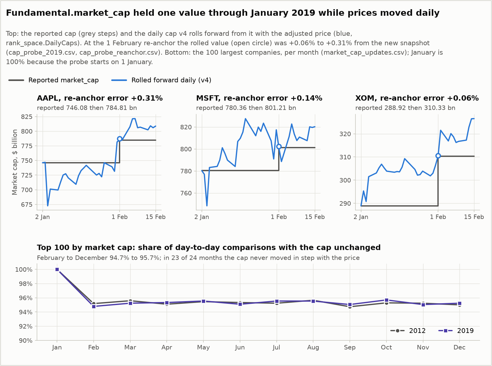

# Data checks

Rank-space returns are the day-to-day change in the capitalisation held at each rank, so the
strategy needs a capitalisation that moves every day. This page records what QuantConnect's
`Fundamental.market_cap` turned out to be, how v4 builds a daily capitalisation from it, and two
checks on the backtests themselves: the margin check that set the leg size, and the reproduction
of the recorded v3 runs. Every number here comes from a file in
[results/checks/](../results/checks/). The generated READMEs there
([data](../results/checks/data/README.md), [margin](../results/checks/margin/README.md),
[reproduction](../results/checks/reproduction/README.md)) give the backtest ids and define every
column.

## Fundamental.market_cap is a month-end snapshot

Three probe backtests that place no orders, run on 25 September 2026 on LEAN v2.5.0.0.18126,
supply every figure on this page:

| Probe | Key | What it records |
|---|---|---|
| Probe, 2012 | `probe2__2012` | For the 100 largest primary shares priced above $1 (the strategy's universe rule), how often `market_cap` and the price changed from one day to the next, per month ([probe_main.py](../results/checks/data/code/probe_main.py)) |
| Probe, 2019 | `probe2__2019` | The same for 2019 |
| Cap probe | `capprobe2__2019` | For AAPL, MSFT and XOM, every day from 2 January to 15 February 2019: unadjusted price, adjusted price, `market_cap` and `company_profile.shares_outstanding` ([cap_probe_main.py](../results/checks/data/code/cap_probe_main.py)) |

A first version of the probe had no once-per-day guard and counted repeated `on_data` calls on
the same day as day-to-day comparisons; it was discarded, and every figure below comes from the
corrected version, `probe2`. QuantConnect's backtest lists
([backtest_lists.csv](../results/checks/backtest_lists.csv)) show six probe backtests in the two
probe projects: the three above, the two discarded first-version runs for 2012 and 2019, and a
first run of the cap probe 88 seconds before `capprobe2__2019`, also discarded; what changed
between the two cap-probe runs is not recorded.

What the probes show ([market_cap_updates.csv](../results/checks/data/market_cap_updates.csv),
[cap_probe_2019.csv](../results/checks/data/cap_probe_2019.csv)):

- From February to December of both years, 94.7% to 95.7% of the day-to-day comparisons in a
  month found a company's cap unchanged, and in 66.5% to 84.5% the price had moved while the cap
  had not. About one comparison in 21 found a change: one change per company per month of about
  21 trading days. In January the share unchanged is 100% in both years, because the probe
  starts on 1 January and sees no month boundary.
- In 23 of the 24 months the cap never moved by the same ratio as the price. The exception is
  June 2019, at 0.05% of comparisons.
- In the cap probe, AAPL's `market_cap` is 746.08 bn on every day from 2 to 31 January 2019 and
  784.81 bn from 1 February, while its unadjusted price takes 32 different values over the 32
  logged days. MSFT's goes from 780.36 to 801.21 bn and XOM's from 288.92 to 310.33 bn, both on
  1 February.
- The cap probe logs from the universe selection, which QuantConnect runs at midnight after each
  trading day, so a line dated D carries the close of the trading day before D, and there are no
  lines dated on a Sunday or a Monday. On 2 January 2019 the logged price times
  `shares_outstanding` equals the reported cap for MSFT and XOM (ratio 1.0000). The snapshot is
  the last close of the previous month times a share count.
- In the probe, 10.7% to 28.8% of a month's comparisons found both the cap and the price
  unchanged (`cap_unchanged_share` minus `price_moved_cap_unchanged_share`). The probe, like the
  strategy, acts at the first data event of each date, which comes at midnight on some dates and
  at the 16:00 close on others; a 16:00 call followed by a midnight call on the next date sees
  the same closing price twice. The strategy's own timing is described in
  [methodology.md](methodology.md#daily-timeline).

So `market_cap` holds one value, the previous month-end close times the shares then
outstanding, for a whole month, and changes on the first trading day of the next month.

Runs v1 to v3 ranked companies and computed rank returns on the raw field. On most days no rank's capitalisation had changed, so most daily rank returns were exactly
zero, and on the day a snapshot changed they carried a month of price movement at once. The
order of the ranking could change only when a reported cap changed. The rank-space signal those
runs traded, and the paper-weight P&L they report, are therefore not the paper's daily
quantities, and v1 to v3 are superseded ([results/superseded/](../results/superseded/)).

## The rolled-forward daily capitalisation (v4)

`DailyCaps` in [rank_space.py](../rank_space.py) turns the monthly field into a daily one. For
each company it keeps an anchor: the last reported cap $C_a$ and the split- and
dividend-adjusted price $P_a$ on the day that value was first seen. On day $t$ it returns

$$
c_t = C_a \, \frac{P_t}{P_a} ,
$$

with $P_t$ the adjusted price on day $t$.

- **Re-anchor rule:** on a company's first observation, and whenever the reported value differs
  from the anchored one, the anchor is reset to the reported value and that day's adjusted price,
  and the reported value is used unchanged that day. In the data this happens on the first
  trading day of each month, when the new snapshot arrives.
- **Non-positive adjusted price:** the reported value is returned and the anchor is kept.
- **Where it runs:** in `select()`, the daily universe selection, for every company that passes
  the universe filter (fundamental data, a positive cap, a price above $1, the primary share
  class), before the day's data and on the previous close. The 130 largest by the rolled value
  are subscribed, and `ranked_caps()` ranks the 100 largest subscribed companies on the same
  values, so both the ranking and the rank returns use it. The project parameter
  `cap_source = "reported"` switches back to the raw field and reproduces v1 to v3
  ([reproduction](#reproduction-of-the-v3-runs)).

Anchor and price refer to the same close. The snapshot that arrives on the first trading day of
a month is the previous month-end close times a share count, and the adjusted price the
selection sees on that day is the same close.

The adjusted price is used because the ratio of two adjusted prices is the total return between
the two dates, so splits cancel and no share count is needed.

Price times `company_profile.shares_outstanding` cannot replace the rolled value, because that
share count is restated for splits made after the date. On 2 January 2019 AAPL's logged price times `shares_outstanding` is
2,984.32 bn, four times its reported cap of 746.08 bn (ratio 4.0000), while the ratio is 1.0000
for MSFT and XOM. On past dates, price times shares would put every company that later split at
a multiple of its size and scramble the ranking.

### Validation at the 1 February 2019 snapshot

Each company's January anchor, rolled forward with the adjusted price to 1 February, against the
new snapshot ([cap_probe_reanchor.csv](../results/checks/data/cap_probe_reanchor.csv)):

| Company | Anchor, 2 Jan 2019, bn | Rolled forward to 1 Feb, bn | New snapshot, 1 Feb, bn | Error | Share count implied by the snapshots |
|---|---|---|---|---|---|
| AAPL | 746.08 | 787.23 | 784.81 | +0.31% | −0.31% |
| MSFT | 780.36 | 802.34 | 801.21 | +0.14% | −0.14% |
| XOM | 288.92 | 310.52 | 310.33 | +0.06% | −0.05% |

The error is the rolled value over the new snapshot, minus one. The implied share count is the
new snapshot over the anchor cap times the unadjusted price ratio, minus one: it fell by about as
much as each error, so most of the error is shares retired during January, which the rolled
value cannot see. The rest is within the rounding of the logged prices to cents. Between the two
dates the adjusted and unadjusted prices moved by the same ratio to within 0.012%, so no dividend
or split fell inside the check.

### Caveats of the rolled value

1. **Dividends count as return until the next snapshot.** The adjusted price does not fall on an
   ex-dividend date, so the rolled value keeps the dividend, while the next snapshot, a price
   times a share count, does not. The paper's rank return is a change in capitalisation and
   excludes dividends. The rolled value moves each dividend from its ex-date to the next re-anchor,
   where the cap steps down by about the dividend. The validation window held no dividend, so the
   size of this step was not measured.
2. **Each re-anchor steps the cap by the anchoring error.** On the day a snapshot arrives, each
   company's daily cap jumps from the rolled value to the reported one: by 0.06% to 0.31% in the
   check, from share-count changes during the month, and by the dividend of caveat 1 where one
   fell. The step enters that day's rank return, once a month per company. Whether these steps
   add to or subtract from the before-cost P&L was not measured.
3. **A company seen for the first time mid-month** enters at its reported value, which can be up
   to a month old, and is rolled from there until the next snapshot. The 403-day warm-up covers
   this for companies already listed when a backtest starts. It still applies to new listings
   and to companies that newly pass the universe filter.
4. **The validation is narrow.** It covers one month-end and three companies. The rolled value
   has not been compared with an independent daily capitalisation such as CRSP's.
5. **Share counts appear to be dated at their as-of date.** AAPL's
   `company_profile.shares_outstanding` changed from 18.9192 bn to 18.8611 bn in the selection
   dated 19 January 2019, which carries the close of 18 January. 18.8611 bn is four times
   4,715,280,000 (the field is restated for the 2020 split), the count that Apple's quarterly
   report gives "as of January 18, 2019"; Apple filed that report on 30 January 2019. The
   1 February snapshot, 784.81 bn, is the 31 January close (166.44) times that count, so here the
   count was public before the month-end it was applied to. Where a count's as-of date falls
   before a month-end and its filing after it, the snapshot would use a figure not yet published.
   That was not tested beyond this case; the effect on a cap is the change in the share count
   between two reports, −0.31% for AAPL here.

## Margin check

v3 held a leg of 5% of equity per open rank. QuantConnect's default margin model asks for initial
margin of 50% of an order's value (from the sample error QuantConnect attaches to each run's
analysis), so the account can hold about twice its equity in positions, and the state machine
does not cap the number of open ranks. Two backtests on 25 September ran the v3 code at half the
leg, on the same day and LEAN build as the re-runs at the full leg
([comparison.csv](../results/checks/margin/comparison.csv)):

| Chunk | Leg | Orders | Rejected | Rejected share | Order cap | Last fill | Net | Fees | Gross exposure, median | Samples at 1.9x or more |
|---|---|---|---|---|---|---|---|---|---|---|
| 2011 to 2017 | 5% | 10,001 | 4,465 | 44.65% | hit 2017-02-09 | 2017-02-02 | +1.804% | $57,053.51 | 1.20 | 20.8% |
| 2011 to 2017 | 2.5% | 7,654 | 237 | 3.10% | not reached | 2017-12-27 | +5.165% | $41,279.15 | 0.63 | 1.5% |
| 2018 to 2024 | 5% | 10,001 | 4,091 | 40.91% | hit 2024-02-05 | 2024-02-02 | +24.124% | $72,076.76 | 1.35 | 21.7% |
| 2018 to 2024 | 2.5% | 7,555 | 2 | 0.03% | not reached | 2024-12-26 | +16.148% | $45,236.41 | 0.69 | 0.2% |

At 5% about four orders in ten were rejected, the rejected orders counted toward the order cap,
and the book QuantConnect held was the signal cut down to the margin limit, at times without its
SPY hedge. At 2.5% the book fits. Net returns are not comparable between the rows: the full-leg
runs stopped at the order cap and the half-leg runs did not. All four runs used the monthly
reported cap, as v3 did. The gross exposure columns are computed from the exposures as exported,
before `equity.csv` rounds them to four decimals.

v4 takes 2.5% as its default (`leg_weight = 0.025`). Across the eight v4 windows, 0 to 35 orders
were rejected ([v4/summary.csv](../results/v4/summary.csv), column `orders_invalid`). On daily
capitalisations the v4 book held more than the half-leg v3 runs: a median gross exposure of 1.08
to 1.36 times equity per window (`exposure_long` minus `exposure_short` over the samples in each
window's `equity.csv`).

## Reproduction of the v3 runs

The two recorded v3 runs ran on 22 September 2026 with a single `main.py` (SHA-256
`6b42cfb3...` as run on QuantConnect). The code was then split into `main.py` and `rank_space.py`, and later extended to
v4. Four backtests on 25 September test whether either change altered what v3 does
([comparison.csv](../results/checks/reproduction/comparison.csv)):

| Run | Key | Code | Parameters | LEAN | Net | Sharpe | Fees | Closed trades | Orders |
|---|---|---|---|---|---|---|---|---|---|
| 2018 to 2024, recorded (22 Sep) | `sa__v3_2018` | recorded `main.py` | code defaults | v2.5.0.0.18116 | +24.435% | 0.077 | $72,130.44 | 3,010 | 10,001 |
| 2018 to 2024, re-run | `rerun__sa_v3_2018` | refactored `main.py` and `rank_space.py`, before v4 | code defaults | v2.5.0.0.18126 | +24.124% | 0.072 | $72,076.76 | 3,013 | 10,001 |
| 2018 to 2024, control | `control__sa_v3_2018_recorded_code` | recorded `main.py` | code defaults | v2.5.0.0.18126 | +24.124% | 0.072 | $72,076.76 | 3,013 | 10,001 |
| 2018 to 2024, v4 code | `check__v3_via_params_2018` | v4 `main.py` and `rank_space.py` | `cap_source=reported`, `leg_weight=0.05` | v2.5.0.0.18126 | +24.124% | 0.072 | $72,076.76 | 3,013 | 10,001 |
| 2011 to 2017, recorded (22 Sep) | `sa__v3_2011` | recorded `main.py` | `start_year=2011`, `end_year=2017` | v2.5.0.0.18116 | +0.675% | −0.149 | $56,727.99 | 2,709 | 10,001 |
| 2011 to 2017, re-run | `rerun__sa_v3_2011` | refactored, before v4 | `start_year=2011`, `end_year=2017` | v2.5.0.0.18126 | +1.804% | −0.119 | $57,053.51 | 2,717 | 10,001 |

**The refactor is exact.** The re-run, the control and the v4 code with v3 parameters are
identical to each other on the 2018 to 2024 chunk: all 27 statistics, all 3,013 closed trades
and all 10,001 orders, compared on every exported field. The refactored code gives what the
recorded code gives on the same day, and the v4 code reproduces v3 through its parameters. The
2011 to 2017 chunk has a re-run but no control. The unit tests check the same property offline:
`rank_weights` after the refactor against a verbatim copy of the recorded code on 240 seeded
random panels, and `select()` with `cap_source = "reported"` against the recorded `select()`
([tests/test_rank_space.py](../tests/test_rank_space.py)).

**The recorded runs differ from all of them.** 14 of the 27 statistics differ in the 2018 to
2024 chunk and 13 in the 2011 to 2017 chunk, 15 across both. The control runs the recorded code
and shows the same difference, so the difference lies on QuantConnect's side, in its data or its
engine.

In both chunks the first order that differs is an MDT order
([first_divergence.csv](../results/checks/reproduction/first_divergence.csv)):

- 2018 to 2024: order 27, submitted 2018-01-02, MDT. Recorded: 765 shares at 65.105318.
  Re-run: 772 shares at 64.580455.
- 2011 to 2017: order 21, submitted 2011-01-12, MDT. Recorded: 2,015 shares at 24.911423.
  Re-run: 2,031 shares at 24.710592.

Every earlier order is identical. Pairing the filled orders of each recorded run and its re-run
on submission time and symbol
([fill_price_ratios.csv](../results/checks/reproduction/fill_price_ratios.csv)), the re-run's MDT
fill price is 0.991938 times the recorded one on all 46 matched fills of the 2018 chunk and all
55 of the 2011 chunk, and LRCX's is 1.000031 times on its 16 matched fills in the 2018 chunk.
The ratio is exactly 1 for the other 147 of 149 matched symbols in the 2018 chunk and 136 of 137
in the 2011 chunk.

One constant factor across years of fills is what a change in a stock's price adjustment
produces. QuantConnect trades US equities on split- and dividend-adjusted prices by default, and
a dividend booked after the recorded runs rescales the stock's whole earlier price history by
one factor. A 0.81% lower MDT price buys more shares for the same target weight, so the first MDT
order already differs, and the book, the order sequence and the statistics drift apart from
there. The exports record only the factor; a new MDT dividend is the likely cause, but it was not
observed.

QuantConnect also upgraded LEAN between the two dates, from v2.5.0.0.18116 to v2.5.0.0.18126.
The exports of the recorded runs do not carry a version; it comes from a separate export of
their server statistics, `engines__original_runs.json.gz` in [results/raw/](../results/raw/).
Data and engine changed together and these runs cannot separate the two. Among the matched
fills, only the MDT and LRCX prices differ.

The v3 figures quoted elsewhere in this repository are those of the recorded runs. Every v4
window ran on v2.5.0.0.18126.

## EBITDA growth

The probe also measured `operation_ratios.ebitda_growth.one_year` for the companion DCF
repository ([ebitda_growth_monthly.csv](../results/checks/data/ebitda_growth_monthly.csv)). The
stat-arb strategy does not use that field.
